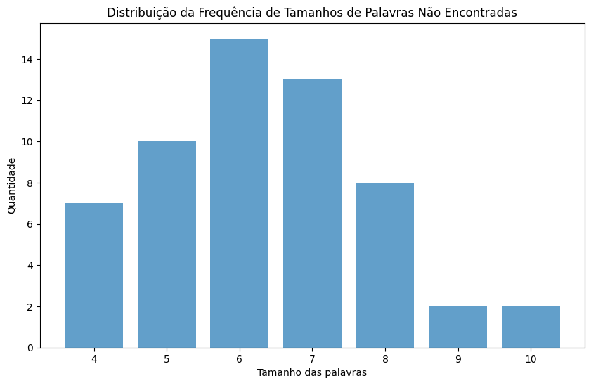
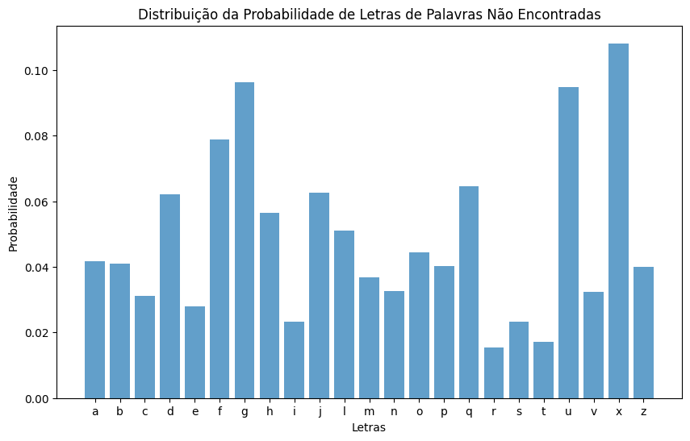

# Jogo de Forca

## Introdução

Neste projeto o grupo projetou e avaliou um jogador de forca, incluindo um arquivo com a porcentagem de acerto do algoritmo dada uma amostra de 100 palavras.

## Implementação

1. Certifique-se de ter o python instalado em seu computador; 
2. Clone esse repositório para algum lugar de sua máquina, utilizando a URL `https://github.com/insper-classroom/241-alglin-aps7-rafa-e-ribolla-aps-7.git`; 
3. Instale as bibliotecas necessárias contidas no arquivo `requirements.txt`, através do comando: `pip install -r requirements.txt`.

## Organização

1. `JogoDeForca.py` com a classe que executa o jogo; 
2. Arquivo `funcoes.py` com todas as funções criadas para fazer o projeto; 
3. Criação do arquivo `demo.ipynb` para demonstração com 100 jogos de forca; 
4. Criação do arquivo `fator_de_erro.ipynb` para criação dos gráficos de erros cm 1000 jogos de forca; 
5. Adição de comentários de explicação ao decorrer do código. 
6. Criação do `requirements.txt` para instalação de bibliotecas;  
7. Arquivo `.gitignore`.

## Arquivo Demo

1. Rode o arquivo `demo.py`; 
2. O arquivo executará 100 jogos de forca e mostrará a porcentagem de acerto ao final. 

## Leitura de nosso dicionário de palavras

Em primeira mão, realizamos a leitura de nossas palavras, encontradas no [arquivo](https://www.ime.usp.br/~pf/dicios/br-sem-acentos.txt) em formato `txt` publicado pelo IME e adicionamos na nossa variável `content`.

## Funções

No arquivo `funcoes.py` definimos as funções que usamos durante a criação do algoritmo, sendo elas:

#### 1- Calcula a quantidade de letras

Esta função calcula a quantidade de ocorrências de cada letra em um conjunto de palavras. Ela itera sobre cada palavra no conteúdo fornecido, e para cada letra na palavra, incrementa o contador dessa letra no dicionário `quant`, que armazena as contagens de cada letra. O dicionário `quant` é então retornado.

#### 2- Calcula a probabilidade

Função que calcula a probabilidade de cada letra ocorrer com base na contagem de letras fornecida. Primeiro, ela soma todas as contagens de letras para obter o total de letras. Em seguida, itera sobre as chaves do dicionário de contagem de letras (`quant`), e para cada letra, calcula a probabilidade dividindo a contagem da letra pelo total de letras. Retorna um dicionário onde as chaves são as letras e os valores são suas probabilidades de ocorrência.

#### 3- Encontra a maior probabilidade

Esta função determina a letra com a maior probabilidade de ocorrência, considerando apenas as letras que ainda não foram jogadas (letras_jogadas). Ela itera sobre as letras e suas probabilidades no dicionário `probs`. Se a probabilidade de uma letra for maior que a probabilidade máxima atual (inicializada como 0) e a letra não estiver na lista de letras já jogadas, atualiza a letra e a probabilidade máxima. Retorna a letra com a maior probabilidade.

#### 4- Remove as palavras dado uma letra

Função que remove todas as palavras do conteúdo em que a letra especificada não está presente. Itera sobre cada palavra no conteúdo e adiciona apenas as palavras que contêm a letra especificada em uma nova lista, que é retornada.

#### 5- Remove as palavras dado um índice

Esta função remove todas as palavras do conteúdo em que a letra especificada está presente no índice fornecido. Itera sobre cada palavra no conteúdo e adiciona apenas as palavras em que a letra está no índice fornecido em uma nova lista, que é retornada.

#### 6- Remove as palavras dado um tamanho

Função que remove todas as palavras do conteúdo que não têm o tamanho especificado. Itera sobre cada palavra no conteúdo e adiciona apenas as palavras que têm o tamanho especificado em uma nova lista, que é retornada.

#### 7- Calcula a frequência de letras de palavras

Esta função calcula a frequência de cada letra em uma lista de palavras. Primeiro, a função cria uma lista de todas as letras nas palavras fornecidas. Em seguida, utiliza a classe Counter do módulo collections para contar a ocorrência de cada letra na lista. Retorna um dicionário onde as chaves são as letras e os valores são suas frequências.

## Algoritmo 

Nosso loop principal executa 100 vezes, criando um novo jogo a cada iteração e tentando adivinhar a palavra usando uma abordagem baseada em probabilidades de letras. Calculamos a probabilidade de cada letra com base nas letras já tentadas e nas palavras restantes no dicionário. Em seguida, tentamos a letra com a maior probabilidade no jogo e atualizamos o dicionário de palavras possíveis. Se a letra está correta, revelamos as instâncias na palavra e continuamos, senão, decrementamos as vidas. Se a palavra não puder ser adivinhada dentro do número de vidas, a adicionamos à lista de palavras erradas; caso contrário, à lista de palavras adivinhadas. Ao final, calculamos a quantidade de acertos e imprimimos nossa porcentagem (95%).

## Principais casos de erro

No arquivo `fator_de_erro` realizamos a análise de nossos erros e separamos o arquivo, pois testamos com 1000 jogos de forca e com isso conseguimos construir duas tabelas e dois gráficos com maior precisão.

## Tabelas

Para melhor análise dos dados, imprimimos a frequência de aparição de cada palavra dado seu tamanho e encontramos a tabela `Tamanho da Palavra pela Frequência`, que segue uma distribuição normal, dado que palavras muito pequenas e muito grandes são pouco frequentes, diferentemente de palavras "medianas", entre 8 e 12 por exemplo. Após isso, para obtermos uma análise letra por letra realizamos a tabela `Letras pela Frequência de nossa amostra` que mostra as letras mais frequentes de nossas 1000 palavras testadas (nossa amostra) e percebemos semelhança com textos maiores, como mostrado no [estudo](https://www.mat.uc.pt/~pedro/lectivos/CodigosCriptografia1011/interTIC07pqap.pdf) de Pedro Quaresma e Augusto Pinho.

### 1- Tamanho da Palavra pela Frequência

| Tamanho da Palavra | Frequência |
|---|---|
| 1 | 4 |
| 2 | 62 |
| 3 | 296 |
| 4 | 1604 |
| 5 | 5481 |
| 6 | 11397 |
| 7 | 20548 |
| 8 | 30681 |
| 9 | 37390 |
| 10 | 39831 |
| 11 | 35120 |
| 12 | 26824 |
| 13 | 17347 |
| 14 | 9961 |
| 15 | 4994 |
| 16 | 2207 |
| 17 | 966 |
| 18 | 405 |
| 19 | 158 |
| 20 | 60 |
| 21 | 20 |
| 22 | 7 |
| 23 | 3 |

### 2- Letras pela Frequência de nossa amostra 

| Letra | Frequência |
|---|---|
| a | 1437 |
| b | 122 |
| c | 386 |
| d | 355 |
| e | 1180 |
| f | 127 |
| g | 156 |
| h | 71 |
| i | 901 |
| j | 32 |
| l | 274 |
| m | 571 |
| n | 428 |
| o | 744 |
| p | 224 |
| q | 31 |
| r | 903 |
| s | 1036 |
| t | 406 |
| u | 274 |
| v | 185 |
| x | 37 |
| z | 75 |

## Gráficos

Por final, realizamos a construção de dois gráfico, sendo eles: `Distribuição da Frequência de Tamanhos de Palavras Não Encontradas` e `Distribuição da Probabilidade de Letras de Palavras Não Encontradas`. Para o primeiro construímos um gráfico com o tamanho das palavras que nosso algoritmo não adivinhou e para o segundo, criamos um gráfico com a probabilidade de uma letra ser de uma palavra não encontrada, ou seja, um gráfico que mostra dado uma letra qualquer, qual a chance dela aparecer em nossas palavras não adivinhadas em relação ao total de palavras testadas pela nossa amostra. 

### 1- Distribuição da Frequência de Tamanhos de Palavras Não Encontradas

Com isso, concluímos que nosso jogador tem maior facildade com palavras muito pequenas, dado que existem menos palavras com 3 ou menos letras, diminuindo as palavras a serem procuradas pelo algortimo. Ao mesmo tempo que palavras muito grandes também são encontradas com facilidade, dado que além de terem mais letras e consequentemente, maior chance de acerto, também são encontradas com menor frequência. Com isso nos sobram as palavras intermediárias, principalmente entre 5 e 7, que obtiveram maior taxa de erro, isso ocorre, pois são palavras as quais não são tão grandes nem tão pequenas e com frequência alta: 5481, 11397, 20548 respectivamente (como visto no tópico `Tabelas`), tendo maior chance de serem parecidas.

### 2- Distribuição da Probabilidade de Letras de Palavras Não Encontradas

 Obtivemos o `x` como a maior probabilidade. A partir disso, percebemos que já que o `x` foi a terceira letra que menos apareceu em nossas palavras testadas, apenas 37 vezes (mostrado no tópico `Tabelas`) e nosso algoritmo sempre chuta a letra que tem mais frequência dentre as palavras que sobraram, as palavras com `x` obtiveram maior taxa de erro, se contrapondo com letras frequentes, como `e` (1180), `i` (901), `r` (903) e `s` (1036).

## Referências

1. Código desenvolvido com o auxílio do [Notebook](https://github.com/mfstabile/AlgLin24-1) realizado pelo professor [Marcio Fernando Stabile Junior](https://github.com/mfstabile);
2. [ChatGPT](https://chat.openai.com/) para saciar dúvidas relacionadas ao projeto;
3. [Análise de Frequências da Língua Portuguesa](https://www.mat.uc.pt/~pedro/lectivos/CodigosCriptografia1011/interTIC07pqap.pdf) por Pedro Quaresma e Augusto Pinho;
4. Utilização do [dicionário](https://www.ime.usp.br/~pf/dicios/br-sem-acentos.txt) sem acentos do [IME](https://www.ime.usp.br/).

## Desenvolvedores

Projeto desenvolvido por Gustavo Colombi Ribolla e Rafaela Afférri de Oliveira.